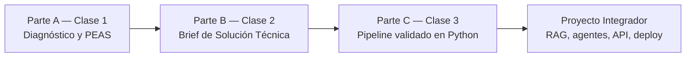

# TP Integrador — Entrega 1: Del Diagnóstico al Pipeline Validado

*Trabajo Práctico entregable — Clases 1 a 3*

**Asignatura:** Desarrollo de Sistemas de Inteligencia Artificial

**Objetivo del TP:** consolidar todo lo visto en las Clases 1, 2 y 3 en el primer bloque construible del Proyecto Integrador — pasar de una idea de producto a un diagnóstico de arquitectura, de ahí a una especificación técnica, y de ahí a un pipeline en Python que extrae y valida datos reales contra un contrato.

> **Para quienes vienen de las Microcredenciales**
> En las Microcredenciales usaron marcos como el Value Proposition Canvas y probaron Prompt Engineering para diseñar productos. Acá esos marcos se vuelven insumo directo de código: el perfil del usuario define qué tablas SQL y qué System Prompt diseñamos, y el prompt deja de ser "texto lindo" para volverse una especificación de contrato que Pydantic hace cumplir. El "qué" ya lo saben — este TP construye el "cómo se implementa".

---

## Cómo funciona esta entrega

* **Es progresiva.** Tres partes, una por clase. Cada parte se apoya en la anterior: no se puede hacer la Matriz de Intenciones sin el PEAS, ni el pipeline de Pydantic sin el contrato JSON.
* **Ortelana Textil es el ejemplo guía**, no el entregable. Todo lo que resolvemos en clase sobre Ortelana ustedes lo replican sobre **su propio dominio**.
* **Es la base del Proyecto Integrador.** Lo que diseñen y programen acá se sigue construyendo durante todo el cuatrimestre: embeddings, RAG, orquestadores, agentes, deploy. La calidad de este diseño inicial se paga o se sufre las 13 clases siguientes.
* **Modalidad:** grupal, según los grupos ya conformados.

> [!IMPORTANT] **Esta entrega reemplaza y absorbe el TP1 (Brief de Solución).**
> Si ya empezaron el TP1, la Parte B es exactamente ese trabajo — no se pierde nada, se le suman la Parte A (diagnóstico) y la Parte C (implementación).

---

## El hilo conductor



| Parte | Pregunta que responde | Artefacto que produce |
| --- | --- | --- |
| **A** | ¿Existe un problema real donde la IA agregue valor, y qué agente lo resuelve? | Caso + evidencia de alucinación + PEAS extendido |
| **B** | ¿Qué hace el LLM, qué hace el código, y cuál es el contrato entre ambos? | Brief de Solución: Matriz de Intenciones + JSON + SQL + System Prompt |
| **C** | ¿El contrato se cumple cuando el modelo falla? | `schemas.py` + script con API real + tabla de resultados del lote |

---

## Elección del dominio

Elijan **un dominio propio**. No pueden usar Ortelana Textil — ese es el caso de la cátedra. Puede ser una idea propia, un negocio que conozcan (el de su familia, donde trabajan, un emprendimiento) o uno ficticio pero concreto. A modo de guía:

| Dominio | Caso de uso sugerido | Por qué funciona bien |
| --- | --- | --- |
| Legal | Consulta de jurisprudencia | Alto volumen de documentos + lenguaje técnico |
| Salud | Asistente de pre-diagnóstico | Complejidad cognitiva alta |
| Finanzas | Análisis de balances | Datos estructurados + lenguaje natural |
| Retail | Asistente de stock y pedidos | Latencia + volumen |
| RRHH | Clasificación de CVs | Volumen repetitivo + criterios complejos |

> **El dominio se elige una sola vez**
> El Proyecto Integrador se construye sobre esta base durante 16 clases. Elijan un caso que les interese sostener y que tenga un dolor real: **datos desestructurados, procesos manuales, o decisiones que hoy dependen de que una persona lea e interprete algo**.

---

## Parte A — Diagnóstico y Arquitectura (Clase 1)

Reúne el taller "El Proveedor Enojado", el Ciclo del Agente y el PEAS extendido.

### A.1 — El caso

En 3 o 4 líneas: de qué se trata la empresa o situación, y cuál es el proceso manual o desestructurado que quieren automatizar. Concreto, no abstracto ("una IA que ayuda a la gente" no permite definir un PEAS).

### A.2 — Evidencia de la necesidad (réplica de "El Proveedor Enojado")

Abrir ChatGPT, Claude o Gemini y pedirle que resuelva una consulta real de su dominio **sin darle la fuente de verdad** (sin el reglamento, sin la base de datos, sin el catálogo). Ejemplo del formato:

```
"Actuá como el sistema de atención de [su empresa].
Un usuario pregunta: '[consulta típica de su dominio que requiere un dato interno]'.
Respondé como lo haría el sistema."

```

**Documentar:**

* La respuesta del modelo, completa.
* Qué parte inventó (marcarla). ¿Con qué nivel de confianza la presentó?
* Qué le faltó al modelo para responder bien.

### A.3 — PEAS extendido (5 pilares)

| Pilar | Pregunta que responde | Aplicado a su sistema |
| --- | --- | --- |
| Performance | ¿Cómo medimos el éxito? |  |
| Environment | ¿Dónde opera el sistema? ¿Con qué sistemas legados habla? |  |
| Actuators | ¿Qué puede hacer? (escribir en BD, mandar mail, generar PDF...) |  |
| Sensors | ¿Qué información recibe y por qué canal? |  |
| Base de Conocimiento | ¿Qué sabe el sistema? (BD SQL, PDFs, base vectorial a futuro) |  |

### A.4 — Anatomía del token

Correr `tiktoken` sobre una consulta típica de su dominio, en español y su equivalente en inglés. Reportar la cantidad de tokens de cada una y reflexionar en 2 o 3 líneas: ¿cómo impacta esa diferencia en el costo por consulta si el sistema procesa miles por día?

```python
!pip install tiktoken
import tiktoken

enc = tiktoken.encoding_for_model("gpt-4o")
consulta_es = "..."   # su consulta típica
consulta_en = "..."   # la misma traducida
print(f"ES: {len(enc.encode(consulta_es))} tokens")
print(f"EN: {len(enc.encode(consulta_en))} tokens")

```

> [!IMPORTANT] **Lo que tiene que quedar claro al terminar la Parte A**
> El modelo no falla por ser "malo" — falla porque no tiene acceso a los datos reales. La alucinación es la ausencia de la Base de Conocimiento en el sistema. Ese es el problema que el resto del cuatrimestre resuelve.

---

## Parte B — Brief de Solución Técnica (Clase 2)

Reúne las tres señales de dolor, el dilema Reglas/LLM, el patrón híbrido, la Matriz de Intenciones y los tres artefactos de la especificación técnica.

### B.1 — Señal de dolor

¿Qué señal dispara la necesidad: **volumen repetitivo**, **carga cognitiva** o **latencia humana**? ¿Quién lo sufre, con qué frecuencia, y qué consecuencia concreta tiene hoy no resolverlo?

### B.2 — Usuario objetivo

¿Quién usa el sistema? ¿Qué hace hoy sin la IA?

### B.3 — Matriz de Mapeo de Intenciones

Mínimo 3 filas. Cada una con el Riesgo de Negocio justificado (BAJO / MEDIO / ALTO):

| Entrada del usuario (caos) | Intención (LLM) | Parámetros (LLM) | Acción de backend (determinista) | Riesgo |
| --- | --- | --- | --- | --- |
|  |  |  |  |  |

> **Regla de oro**
> La IA es el **intérprete**, la base de datos es la **autoridad**. El LLM nunca decide una regla de negocio — la extrae del texto y la comunica; el SQL y las APIs la resuelven. El riesgo es ALTO cuando la operación escribe o tiene consecuencia financiera, BAJO cuando solo lee.

### B.4 — Decisión técnica: ¿Reglas o LLM?

Para cada parte del sistema, indicar si es determinista (código/SQL) o probabilística (LLM) y **justificar**. No alcanza con "esto lo hace el LLM": hay que explicar por qué, apoyándose en el diagrama de decisión de la Clase 2 (¿requiere entender lenguaje natural? ¿la respuesta es binaria o matemática?).

### B.5 — Los tres artefactos de la especificación

**a) Contrato de datos (JSON de la API)** — el request que entra al sistema:

```json
POST /api/v1/[su_endpoint]

{
  "canal": "...",
  "texto_libre": "...",
  "adjuntos": [],
  "timestamp": "..."
}

```

Justificar por qué está cada campo.

**b) Esquema de la base de datos (SQL)** — mínimo dos tablas: la entidad principal de su dominio y una tabla de `interacciones` que registre qué intención detectó el LLM y qué respondió.

**c) System Prompt base** — el prompt de extracción que convierte el `texto_libre` en JSON estructurado. Debe fijar el rol, prohibir inventar datos, definir el `null` y prohibir texto extra.

### B.6 — Flujo de valor y flujo del sistema

Una línea de valor: `Input del usuario → paso 1 → paso 2 → Output → valor generado`

Y el flujo técnico (adaptar a su caso):

```
[LLM] Extrae intención y parámetros → JSON
        ▼
[Código] Valida el JSON (Pydantic) → rechaza si hay campos inválidos
        ▼
[SQL / API] Verifica datos reales → resultado de negocio
        ▼
[LLM] Redacta la respuesta humanizada

```

### B.7 — Hipótesis más riesgosa

Una sola oración: la suposición que, si resulta falsa, hace colapsar todo el diseño.

*# Parte C — Pipeline Funcional Validado (Clase 3)

Reúne Zero-shot / Few-shot / CoT, las 4 reglas del JSON confiable, Pydantic V2, Structured Outputs y la gestión de credenciales con `.env`. **Acá se programa.**

### C.1 — `schemas.py`: el contrato en código

Traducir el System Prompt y el JSON de **B.5** a un modelo Pydantic V2. Requisitos:

* Usar `Literal` para el campo de intención (los valores exactos de su Matriz).
* Al menos un `@field_validator` con lógica real (por ejemplo: limpiar y validar un identificador, normalizar un formato, rechazar un rango inválido).
* Campos opcionales con `default` explícito.

### C.2 — Script con API real y Structured Outputs

Un script (`app.py` o notebook) que:

1. Lea las credenciales desde `.env` — **nunca hardcodeadas**. Entregar un `.env.example` sin claves.
2. Envíe un input de su dominio a una API real (OpenAI, Anthropic o Gemini).
3. Use Structured Outputs + el schema de C.1 para garantizar el contrato.
4. Maneje `ValidationError` y errores de red por separado.
5. Imprima los campos extraídos y validados.

### C.3 — Lote de prueba y tabla de resultados

Armar **6 inputs de su dominio**, incluyendo obligatoriamente:

* 1 input ambiguo o incompleto,
* 1 intento de prompt injection o lenguaje hostil.

Correr el pipeline sobre los 6 y completar:

| # | Input (resumido) | Salida del modelo | ¿Validó Pydantic? | Tipo de error si falló |
| --- | --- | --- | --- | --- |
| 1 |  |  |  |  |

### C.4 — Técnica de prompting

¿Usaron Zero-shot, Few-shot o CoT? Justificar la elección. Si usaron Few-shot, mostrar un caso que fallaba en Zero-shot y pasó al agregar ejemplos.

### C.5 — Cierre: dónde se conecta

En 3 o 4 líneas: ¿en qué paso del flujo del sistema de **B.6** encaja este script? ¿Qué le falta todavía para ser el sistema completo? (pista: la Base de Conocimiento de la Parte A sigue sin estar).

> [!WARNING] **La API Key nunca se sube al repositorio — y en Git, borrarla después no salva.**
> Como entregan por Git, la key queda en el **historial de commits** aunque la borren en un commit posterior: cualquiera que clone el repo la recupera con `git log`. Los bots escanean GitHub y GitLab en tiempo real y una key expuesta se compromete en minutos.
> Reglas: `.env` en `.gitignore` **desde el primer commit**; subir solo `.env.example` sin valores; si una key se filtró, hay que **rotarla** (darla de baja y generar una nueva) — borrar el archivo no alcanza.

---

## Qué se entrega

**Un repositorio Git por grupo** (GitHub o GitLab). Se entrega el link. Estructura mínima:

| Archivo | Contenido |
| --- | --- |
| `README.md` | Dominio elegido, integrantes, y cómo correr el script (qué instalar, qué variables van en `.env`) |
| `informe.md` | Partes A y B completas + la narrativa de C.4 y C.5 |
| `schemas.py` | El modelo Pydantic de C.1 |
| `app.py` o `.ipynb` | El script de C.2 |
| `.env.example` | Variables de entorno sin valores reales |
| `.gitignore` | Debe incluir `.env` |
| `resultados_lote.md` | La tabla de C.3 |

**Formato del informe:** Markdown. No hay mínimo de extensión — se evalúa que cada sección tenga contenido específico del dominio, no genérico.

> **Sobre los commits**
> Se espera un historial que muestre trabajo incremental, no un único commit "entrega final" con todo volcado. El historial es parte de cómo evaluamos el proceso — y quién hizo qué.

---

## Rúbrica de evaluación

Cada criterio se puntúa en uno de cuatro niveles: **No logrado (0%)**, **En desarrollo (40%)**, **Logrado (75%)**, **Destacado (100%)** del máximo.

| # | Criterio | Logrado (75%) significa que... | Máx |
| --- | --- | --- | --- |
| 1 | **Caso + evidencia de alucinación** (A.1, A.2, A.4) | El caso es concreto; la respuesta real del modelo está pegada con lo inventado marcado; tiktoken hecho con reflexión de costo | 12 |
| 2 | **PEAS extendido** (A.3) | Los 5 pilares son específicos del dominio y coherentes entre sí | 8 |
| 3 | **Matriz de Intenciones** (B.3) | ≥3 filas, cada riesgo justificado por escritura/lectura y consecuencia | 15 |
| 4 | **Decisión técnica** (B.4) | Cada componente marcado como determinista o LLM **con el porqué**, apoyado en el diagrama de decisión | 12 |
| 5 | **Los tres artefactos** (B.5–B.6) | JSON + SQL + System Prompt completos y consistentes entre sí | 13 |
| 6 | **`schemas.py`** (C.1) | `Literal` con los valores exactos + un `@field_validator` con lógica real | 8 |
| 7 | **Script con API real** (C.2) | Corre punta a punta, separa `ValidationError` de errores de red, credenciales desde `.env` | 12 |
| 8 | **Lote de prueba** (C.3) | 6 inputs incluyendo el ambiguo y el de inyección/hostil, tabla completa | 10 |
| 9 | **Coherencia transversal + cierre** (C.4, C.5) | El `Literal` de C.1 = intenciones de B.3 = salidas de C.3; el JSON de C.2 = contrato de B.5; técnica de prompting justificada; C.5 identifica qué le falta al sistema | 10 |
|  | **Total** |  | **100** |

**Penalizaciones** (se restan del total):

| Situación | Penalización |
| --- | --- |
| API key real en algún commit (aunque esté borrada después) | −15 y aviso para rotar la key |
| `.env` no está en `.gitignore` | −5 |
| Un único commit con todo volcado (sin historial de proceso) | −5 |
| El script no corre en la máquina del docente por algo evitable (path hardcodeado, dependencia sin declarar en el README) | criterio 7 baja un nivel |
| Entrega tardía | según reglamento de la cátedra |

> [!TIP] **Defensa oral opcional (±10 sobre la nota grupal)**
> 5 minutos por grupo, cada integrante explica una parte. Resuelve el "lo hizo uno solo" y el "lo generó una IA y no lo entienden".

---

## Conexión con el Proyecto Integrador

Esta entrega deja el sistema con Sensores, Razonamiento y Actuadores, pero **sin Base de Conocimiento** — igual que el modelo que alucinó en la Parte A. Lo que sigue:

| Unidad | Capa que se suma sobre esta base |
| --- | --- |
| Unidad 3 (Clases 4–5) | Embeddings y búsqueda semántica: en vez de meter todo el catálogo en el prompt, recuperar solo lo relevante |
| Unidad 3–4 (Clase 6+) | RAG y orquestación con LangChain: el sistema consulta la Base de Conocimiento real antes de responder |
| Unidades siguientes | Agentes con herramientas, exposición como API, deploy |

Cada una de esas capas se construye sobre el dominio, el PEAS y el pipeline que entregan ahora.

---

*s

**¿Podemos cambiar de dominio después de esta entrega?**
No es recomendable — el proyecto se construye sobre esta base 13 clases más.

**¿La Parte C tiene que estar "en producción"?**
No. Tiene que correr de punta a punta con una API real y una key propia, y manejar los errores. Nada más.

**¿Y si no tenemos créditos en ninguna API?**

Para desarrollar y probar pipelines con validación de esquemas (como Pydantic) existen plataformas que ofrecen *tiers* gratuitos permanentes o créditos iniciales suficientes para completar prototipos y trabajos prácticos sin costo.

| Plataforma | Modelos recomendados | Capa Gratuita / Nivel | Compatibilidad con Pydantic / JSON |
| --- | --- | --- | --- |
| **Google AI Studio** | Gemini 1.5 Flash / Gemini 2.0 Flash | Gratuito permanente (límites de 15 RPM / 1M TPM) | Alta (soporte nativo de `response_schema`) |
| **Groq** | Llama 3.3 70B, Llama 3.1 8B, DeepSeek R1 | Gratuito permanente con límites de frecuencia | Alta (compatible con SDK de OpenAI / `instructor`) |
| **Cohere** | Command R, Command R+ | Key de desarrollo (Trial) sin expiración (10 RPM) | Alta (Structured Outputs nativos) |
| **Mistral AI** | Mistral Small, Codestral | Tier experimental / Créditos iniciales | Media-Alta (JSON mode y Tool calling) |
| **OpenRouter** | Varias opciones (filtro `:free`) | Acceso a modelos 100% gratuitos y de pago | Varía según el modelo seleccionado |


**Plataformas Gratuitas Destacadas**

**Google AI Studio (Gemini)**
Es la opción más robusta para evitar gastos durante el desarrollo.

* **Acceso:** Creando una cuenta en Google AI Studio se obtiene un API key de prueba permanente.
* **Punto fuerte:** Gemini Flash procesa un volumen alto de tokens por minuto sin costo y la librería oficial permite pasar un modelo Pydantic directamente en el parámetro de configuración (`response_mime_type="application/json"` con `response_schema=TuModeloPydantic`).
* **Limitación:** En el nivel gratuito, Google puede utilizar las interacciones para entrenamiento (adecuado para datos académicos o simulados, no para datos sensibles).

**Groq**
Destaca por la velocidad de inferencia (LPU) y la gratuidad de su nivel de entrada.

* **Acceso:** Registro directo en Groq Console para obtener API keys gratuitas.
* **Punto fuerte:** Utiliza una sintaxis idéntica a la API de OpenAI. Cambiando únicamente el `base_url` a `[https://api.groq.com/openai/v1](https://api.groq.com/openai/v1)` y usando el cliente oficial de OpenAI en Python, se pueden implementar respuestas estructuradas.
* **Limitación:** Cuenta con límites de solicitudes por minuto (RPM), aunque suficientes para correr lotes de prueba pequeños.

**Cohere**
Ofrece un entorno pensado para uso corporativo con una capa de prueba accesible.

* **Acceso:** La plataforma otorga una *Trial API Key* desde el panel de desarrollador.
* **Punto fuerte:** Sus modelos de la familia Command R están optimizados para extracción de datos, seguimiento de instrucciones estrictas y uso de herramientas.
* **Limitación:** La clave de prueba limita el tráfico a 10 peticiones por minuto.


**¿El repo puede ser privado?**
Sí, y es lo recomendado. Si es privado, agregar como colaborador al docente. Si es público, con más razón `.env` nunca se commitea.

---

## Bibliografía

* **Russell, S., & Norvig, P. (2021).** *Artificial Intelligence: A Modern Approach.* 4th Ed. Pearson. Capítulos 1 y 2.
* **Osterwalder, A., & Pigneur, Y. (2014).** *Value Proposition Design.* Wiley.
* **Richards, M., & Ford, N. (2020).** *Fundamentals of Software Architecture.* O'Reilly.
* **Huyen, C. (2025).** *AI Engineering: Building Applications with Foundation Models.* O'Reilly. Capítulos 1 y 3.
* **Pydantic V2 Documentation** — docs.pydantic.dev
* **OpenAI API Reference** — Structured Outputs Guide — [platform.openai.com/docs](https://www.google.com/search?q=https%3A%2F%2Fplatform.openai.com%2Fdocs)
* **Mollick, E. (2024).** *Co-Intelligence: Living and Working with AI.* Portfolio.ar
